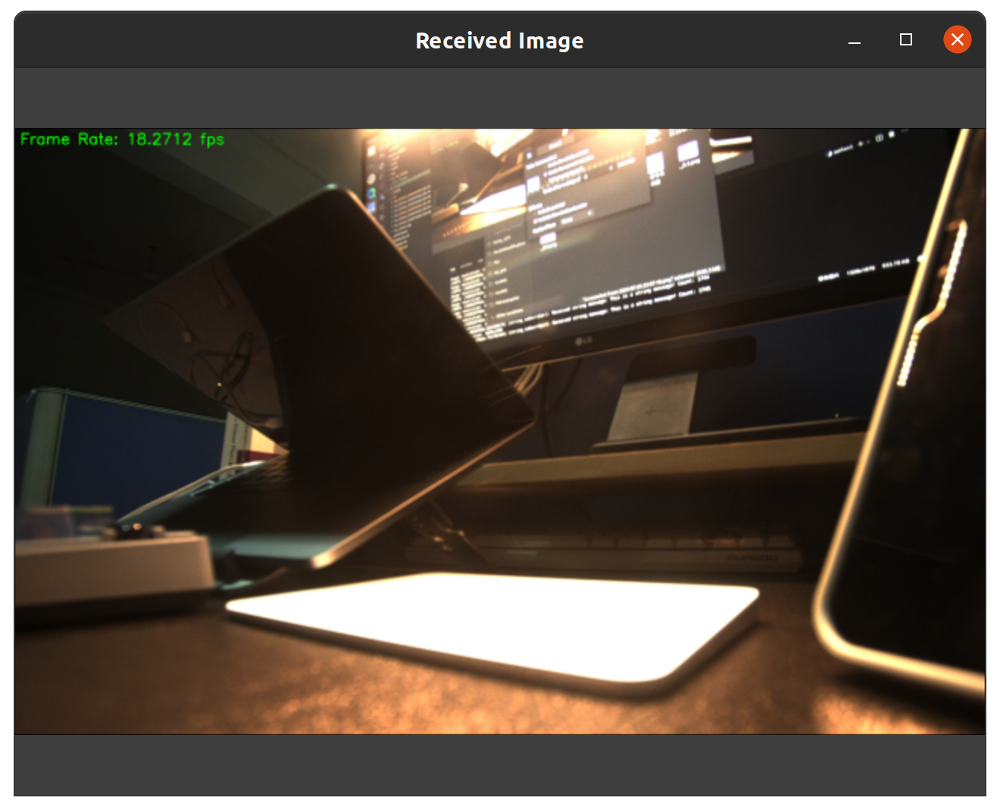
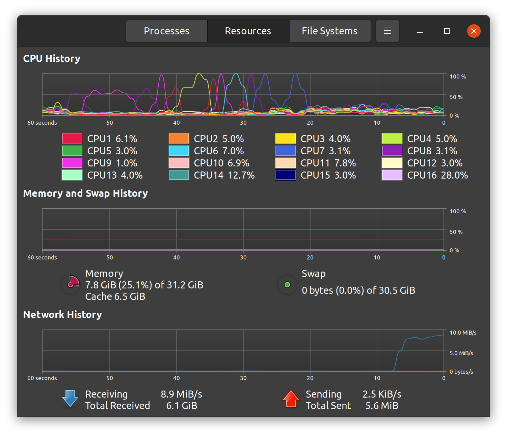
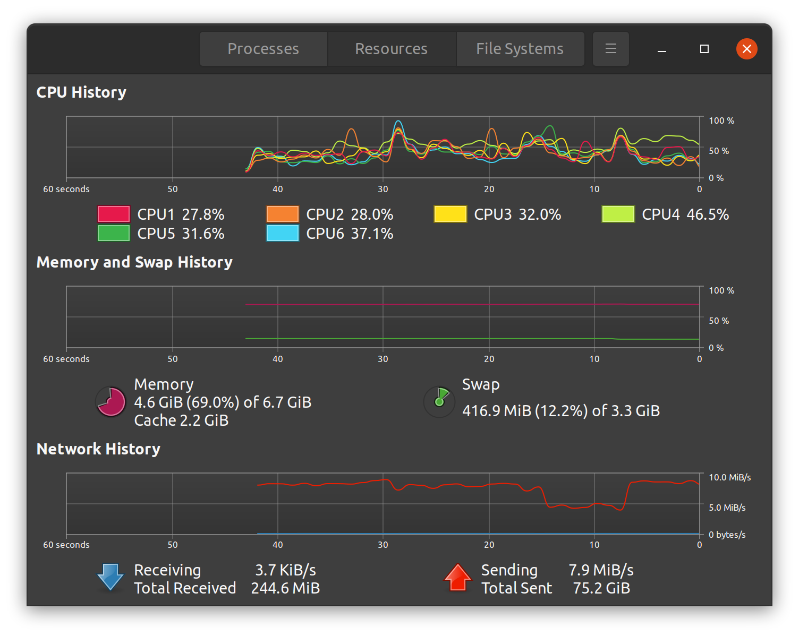

# hk_camera

Tested on Ubuntu 20.04 with ROS2 Foxy.

This code repository is based on [HIKROBOT-MVS-CAMERA-ROS](https://github.com/luckyluckydadada/HIKROBOT-MVS-CAMERA-ROS), and has been upgraded from ROS1 to ROS2.

You can choose to publish both raw image messages and compressed image messages:
```bash
ros2 run hk_camera hk_camera
# or
ros2 run hk_camera hk_camera_compressed_pub
```

## Cyclone DDS Tuning

### Configure Environment

```bash
sudo apt install ros-foxy-rmw-cyclone-cpp
echo 'export RMW_IMPLEMENTATION=rmw_cyclonedds_cpp' >> ~/.bashrc
```

### Parameter Setting

Set the parameters according to the official documentation([DDS tuning information](https://docs.ros.org/en/foxy/How-To-Guides/DDS-tuning.html#cross-vendor-tuning)).

```bash
sudo sysctl net.ipv4.ipfrag_time=3
sudo sysctl -w net.core.rmem_max=2147483648
sudo sysctl net.ipv4.ipfrag_high_thresh=2147483648
```

Create a new configuration file `config.xml`:
```xml
<CycloneDDS xmlns="https://cdds.io/config" xmlns:xsi="http://www.w3.org/2001/XMLSchema-instance" xsi:schemaLocation="https://cdds.io/config https://raw.githubusercontent.com/eclipse-cyclonedds/cyclonedds/master/etc/cyclonedds.xsd">
<Domain id="any">
<Internal>
<MinimumSocketReceiveBufferSize>1024MB</MinimumSocketReceiveBufferSize>
</Internal>
</Domain>
</CycloneDDS>
```

Then, run:
```bash
CYCLONEDDS_URI=/path/to/config.xml
```

### Usage

```bash
ros2 run hk_camera hk_camera_compressed_pub_test_reliable
ros2 run hk_camera hk_camera_compressed_sub_test_reliable
```

As tested on NVIDIA Jetson Xavier NX X509, the image transmission rate at a resolution of 1920*1200 can reach 20 frames per second. The subscription rate has reached the limit of the publishing rate. The maximum frame rate of the camera I'm using is 40Hz. If the CPU performance is stronger, the published messages should be able to reach the maximum frame rate.



The upload and download speed of the network card is approximately 8MB/s.


<center>pc network speed</center>


<center>edge device network speed</center>